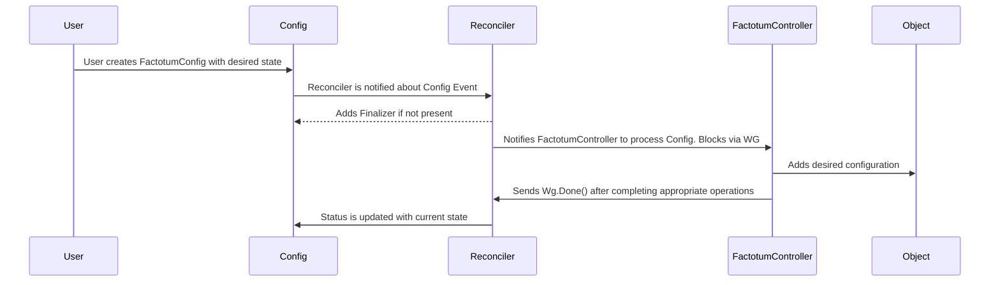
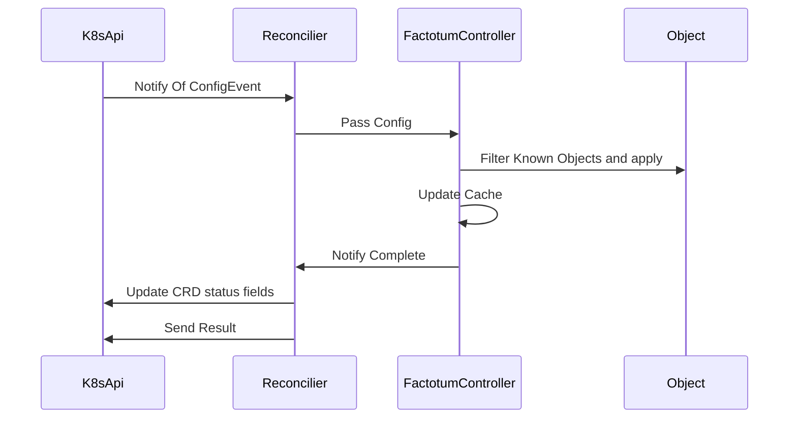
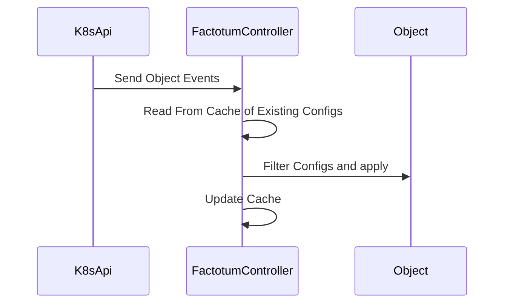

# Factotum

This package contains the interfaces that help drive re-use across the different controllers factotum implements.

# Factotum Controller

Each Factotum Controller implements the same general pattern. Each Controller is tied to a Config and provides a Watch method, and a Process method. Work flows from the operator-sdk provided reconciler to a FactotumController. The FactotumController also enforces desired statue by watching for object changes.

# Object Event Flow

## Events from Config Changes

Events that handle Config CRD creations follow this pattern.

## Events from Object Changes

Node Changes are enforcement events. If something has removed a configuration this is how we put it back.

# Factotum Handlers