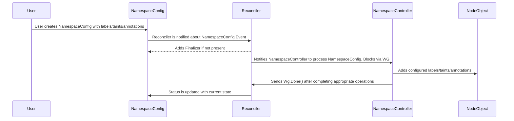
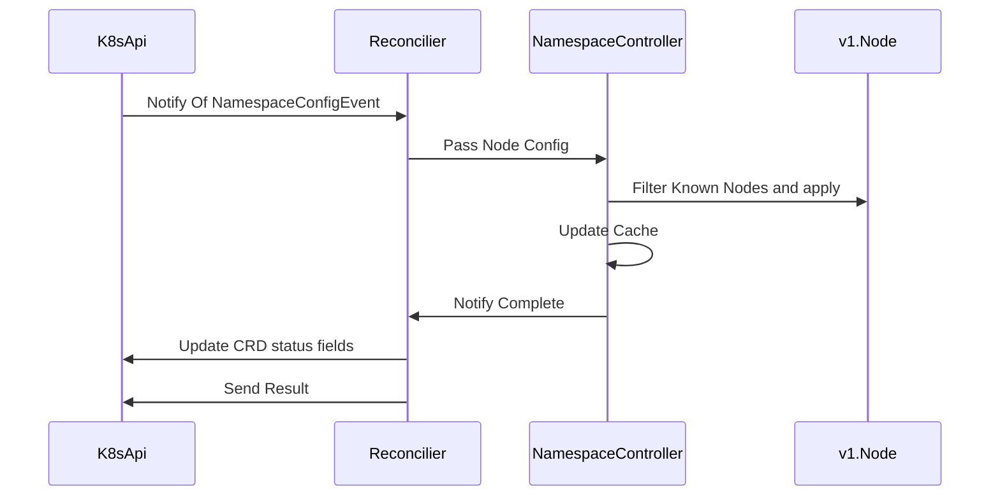
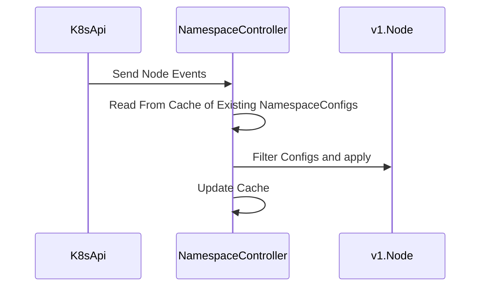

# NamespaceController

The NamespaceController is used to support objconfigs.factotum.io. NamespaceConfigs contain labels/annotations and taints to be applied to Kubernetes Node Objects. Users creates NamespaceConfigs and the desired configuration is applied to the objs. 

The NamespaceConfigs are cached since The NamespaceController also watches for any changes to Nodes that might impact one of our configurations. If for example a label is removed that is present in a NamespaceConfig. It will be added back immediately.

# NamespaceConfig Flow

# Node Event Flow

## Events from NamespaceConfig Changes

Events that handle NamespaceConfig CRD creations follow this pattern.

## Events from Node Changes

Node Changes are enforcement events. If something has removed a configuration this is how we put it back.

