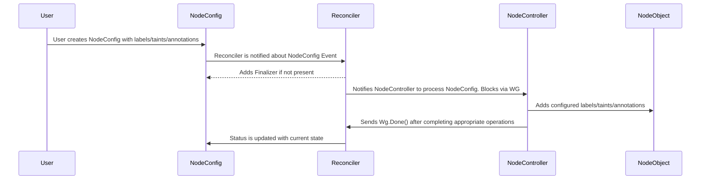
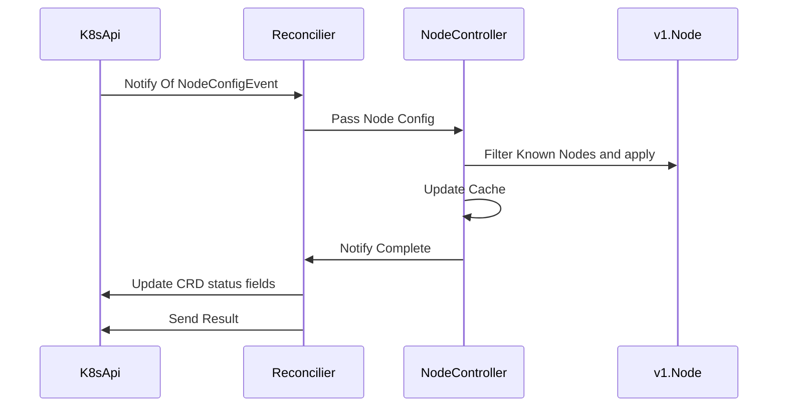
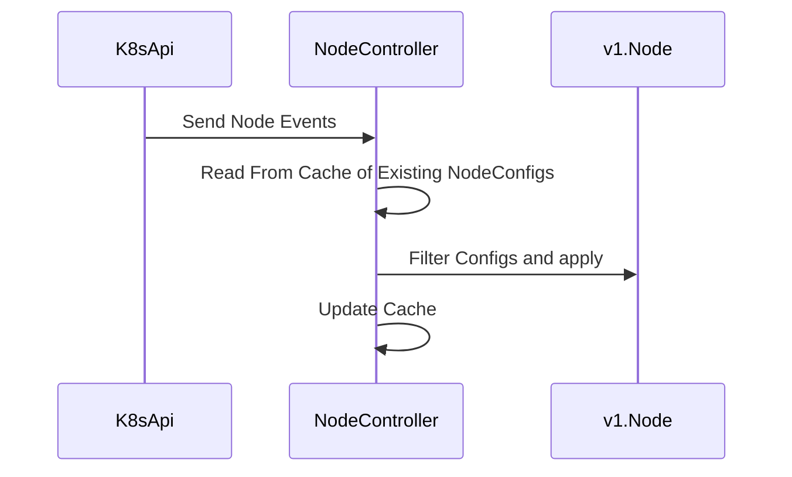

# NodeController

The NodeController is used to support nodeconfigs.factotum.io. NodeConfigs contain labels/annotations and taints to be applied to Kubernetes Node Objects. Users creates NodeConfigs and the desired configuration is applied to the nodes. 

The NodeConfigs are cached since The NodeController also watches for any changes to Nodes that might impact one of our configurations. If for example a label is removed that is present in a NodeConfig. It will be added back immediately.

# NodeConfig Flow

# Node Event Flow

## Events from NodeConfig Changes

Events that handle NodeConfig CRD creations follow this pattern.

## Events from Node Changes

Node Changes are enforcement events. If something has removed a configuration this is how we put it back.

